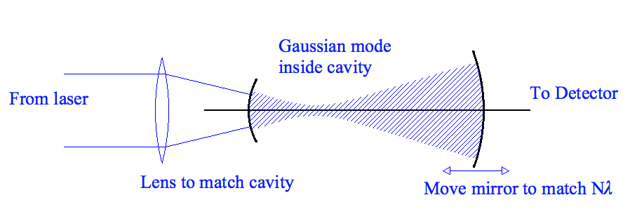
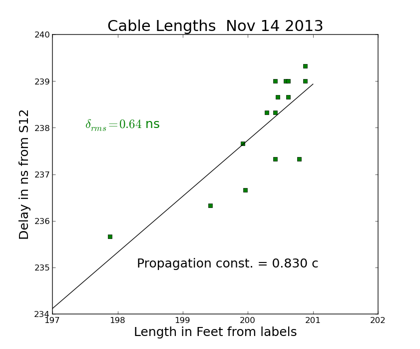

I'm going to use this for testing.  Start each lab day with a to-do list:

- [ ] Item 1
- [ ] item 2
- [x] Item 3

this is another line

Caption:  THis is a diagram taken from class notes showing how to couple a laser into a stable cavity.

In the list below I have transcribed monochromater dial readings and photomultiplier voltages as I scanned for total intensity.

|Monochromater   |   Voltage|
|--------------- | --------------|
|584. |  -1.88|
|582. | -1.27|
|578.5 | -.257|
|573.|-.470|

